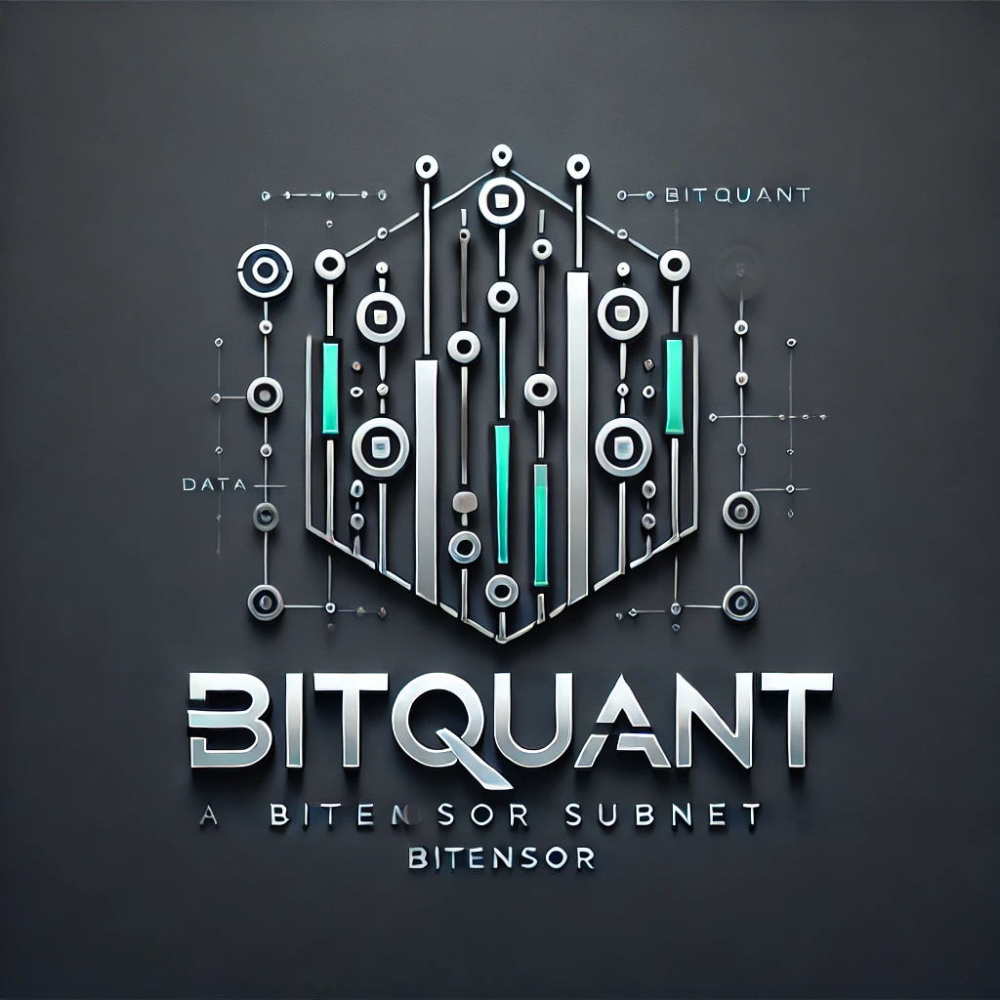

<div align="center">

# **BitQuant** <!-- omit in toc -->
[](https://opensource.org/licenses/MIT)

<p align="center">
  
</p>

---

## A Bittensor Subnet for Quantitative Trading <!-- omit in toc -->

</div>

---
- [Introduction](#introduction)
- [License](#license)

---

## Introduction

BitQuant aims to create a decentralized marketplace for trading signals, where:

1. Miners compete to provide the most profitable trading signals

2. Validators assess signal quality through actual portfolio performance

3. The network rewards successful strategies through built-in incentive mechanisms

This creates a self-sustaining ecosystem where quality trading strategies are rewarded, and the collective intelligence of the network can be leveraged for better trading outcomes.

We also provide comprehensive framework for trading strategy development—from factor mining and combination to strategy backtesting. If you don't have any mature strategy yet, highly recommend you to refer to these well-designed framework we provided which will help you build your own strategy from scratch. 

Have fun!

## License
This repository is licensed under the MIT License.
```text
# The MIT License (MIT)
# Copyright © 2023 Yuma Rao

# Permission is hereby granted, free of charge, to any person obtaining a copy of this software and associated
# documentation files (the “Software”), to deal in the Software without restriction, including without limitation
# the rights to use, copy, modify, merge, publish, distribute, sublicense, and/or sell copies of the Software,
# and to permit persons to whom the Software is furnished to do so, subject to the following conditions:

# The above copyright notice and this permission notice shall be included in all copies or substantial portions of
# the Software.

# THE SOFTWARE IS PROVIDED “AS IS”, WITHOUT WARRANTY OF ANY KIND, EXPRESS OR IMPLIED, INCLUDING BUT NOT LIMITED TO
# THE WARRANTIES OF MERCHANTABILITY, FITNESS FOR A PARTICULAR PURPOSE AND NONINFRINGEMENT. IN NO EVENT SHALL
# THE AUTHORS OR COPYRIGHT HOLDERS BE LIABLE FOR ANY CLAIM, DAMAGES OR OTHER LIABILITY, WHETHER IN AN ACTION
# OF CONTRACT, TORT OR OTHERWISE, ARISING FROM, OUT OF OR IN CONNECTION WITH THE SOFTWARE OR THE USE OR OTHER
# DEALINGS IN THE SOFTWARE.
```
